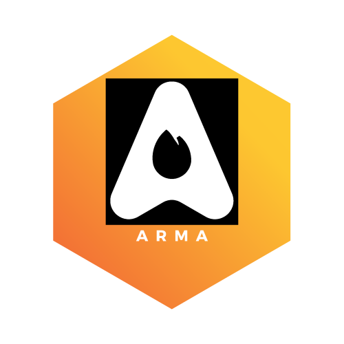

## ArmaLang 

  

ArmaLang is a programming Language based on darija and built to make learning coding simple
for  morroccan people using:

- Node.js
- Nearly (Grammar Describing Language)

# Done  

- variable declaration 
- function definition with arrow functions
- function calls
- some builtin functions
- if and while functions implemented partially
- function definition without arrow functions

# To Do List

Here is some functionalities which will be available in the soon future:
- return keyword
- array && objects 
- asynchronous
- OOP support
- Http module
- Filesystem Module
- OS Module
- Simple web Framework based on Koa

# Documentation 

the full documentation will be under docs directory
- [Darija](./docs/documentation/darija/README.md);
- [English](./docs/documentation/english/README.md)

# People Who Contributed in the Project

- ArmaLang Logo's made by Abdesslam El boukri @Abdessalam-Elboukri